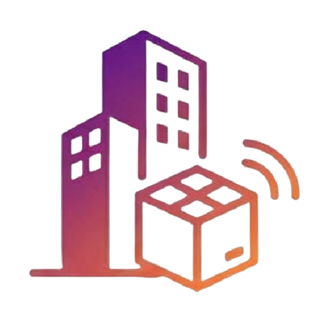

# DePertin Admin - Painel Administrativo

<p align="center">
  
</p>

<p align="center">
  <strong>Painel de gestão</strong> da plataforma DePertin — controle total do marketplace.
</p>

<p align="center">
  
  
  
  
</p>

---

## Sobre

O **DePertin Admin** é o painel administrativo da plataforma DePertin. Desenvolvido em Flutter para web e desktop, permite à equipa de operações gerir todos os aspectos do marketplace — lojas, entregadores, finanças, banners, cidades e suporte ao cliente.

## Funcionalidades

### Dashboard
- Visão geral com métricas do marketplace
- Indicadores de pedidos, lojas ativas e entregadores

### Gestão de Lojas
- Listagem e aprovação de novas lojas
- Visualização de detalhes e status de cada loja
- Ativação e desativação de lojas

### Gestão de Entregadores
- Aprovação de candidaturas de entregadores
- Monitorização de status e atividade

### Financeiro
- Acompanhamento de receitas da plataforma
- Gestão de solicitações de saque
- Configuração de taxas e planos

### Banners Promocionais
- Criação e gestão de banners para a vitrine do app
- Upload de imagens e configuração de links

### Gestão de Cidades
- Configuração de cidades onde a plataforma opera
- Definição de áreas de cobertura

### Configurações
- Parâmetros gerais da plataforma
- Gestão de gateways de pagamento
- Tabela de fretes

### Utilidades
- Gestão de vagas, achados e eventos publicados pelos utilizadores

### Suporte
- Atendimento a tickets de suporte via chat
- Comunicação direta com clientes e lojistas

## Arquitetura

```
lib/
├── main.dart                              # Entrada, rotas, Firebase, i18n
├── firebase_options.dart                  # Configuração Firebase (gerado)
├── screens/
│   ├── login_admin_screen.dart            # Autenticação do administrador
│   ├── dashboard_screen.dart              # Dashboard principal
│   ├── lojas_screen.dart                  # Gestão de lojas
│   ├── entregadores_screen.dart           # Gestão de entregadores
│   ├── financeiro_screen.dart             # Painel financeiro
│   ├── banners_screen.dart                # Gestão de banners
│   ├── admin_city_screen.dart             # Gestão de cidades
│   ├── configuracoes_screen.dart          # Configurações gerais
│   ├── utilidades_screen.dart             # Vagas, achados, eventos
│   └── atendimento_suporte_screen.dart    # Suporte ao utilizador
└── widgets/
    ├── sidebar_menu.dart                  # Menu lateral de navegação
    └── botao_suporte_flutuante.dart       # Botão flutuante de suporte
```

## Rotas

| Rota | Ecrã | Descrição |
|------|------|-----------|
| `/login` | Login Admin | Autenticação do administrador |
| `/dashboard` | Dashboard | Painel principal com métricas |
| `/lojas` | Lojas | Gestão e aprovação de lojas |
| `/entregadores` | Entregadores | Gestão de entregadores |
| `/financeiro` | Financeiro | Receitas, saques e taxas |
| `/banners` | Banners | Gestão de banners promocionais |
| `/admincity` | Cidades | Configuração de cidades |
| `/configuracoes` | Configurações | Parâmetros da plataforma |
| `/utilidades` | Utilidades | Vagas, achados e eventos |
| `/atendimento_suporte` | Suporte | Chat de atendimento |

## Stack Tecnológica

| Camada | Tecnologia |
|--------|------------|
| Framework | Flutter (Dart ^3.11) |
| Backend | Firebase (Firestore, Auth, Storage) |
| Localização | `flutter_localizations` (pt-BR) |
| Design | Material 3 |
| Plataformas | Web, Windows, Linux, macOS, Android, iOS |

## Pré-requisitos

- Flutter SDK ^3.11
- Dart SDK ^3.11
- Navegador moderno (para web) ou ambiente desktop
- Conta Firebase com projeto configurado

## Instalação

```bash
# Clonar o repositório
git clone https://github.com/sigadepertin-oss/DiPertin.git
cd DiPertin/depertin_web

# Instalar dependências
flutter pub get

# Executar na web
flutter run -d chrome

# Executar no desktop (Windows)
flutter run -d windows
```

## Build para Produção

```bash
# Build web
flutter build web

# Build Windows
flutter build windows

# Build Linux
flutter build linux
```

Os artefactos ficam em `build/web/` ou `build/windows/` respetivamente.

## Relação com o App Cliente

Este painel gere os dados consumidos pelo [DePertin Cliente](../depertin_cliente/), partilhando o mesmo projeto Firebase (`depertin-f940f`) e as mesmas coleções Firestore. Alterações feitas aqui (aprovar lojas, configurar taxas, gerir banners) refletem-se em tempo real no app dos utilizadores.

## Licença

Projeto privado. Todos os direitos reservados.
